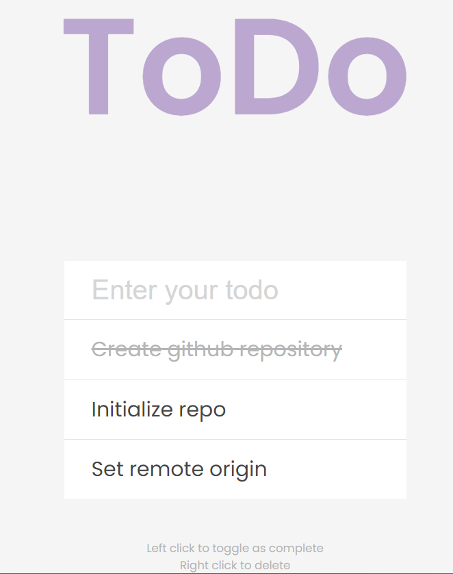

# Todo App

For this project I created a todo application. I created this as a part of the #100DaysOfCode challenge where I have made it a goal to code for 100 days consecutively. 

## How to Install
1. Download this repository
2. Open the index.html with a Live Server

### Credits
- Design Inspo: http://todomvc.com/examples/react/#/
- 10 Javascript Projects in 10 Hours - Coding Challenge https://youtu.be/dtKciwk_si4